# IsdaLog: Autonomous Maritime Catch Consignment & Escrow Logistics Ecosystem

> **Executive Summary:** IsdaLog is an enterprise-grade maritime catch consignment, auction, and cold-chain logistics platform engineered to digitize municipal port economies. The ecosystem couples an edge-resilient Telegram AI gateway (powered by Google Gemini 2.5 Flash with local Ollama vision fallback) with a high-concurrency Laravel 11 / Inertia.js core featuring real-time WebSocket bidding, cryptographic dual-OTP chain of custody, automated escrow settlements, and BFAR regulatory compliance auditing.

<p align="center">
  <a href="https://isdalog-production.up.railway.app" target="_blank">
    
  </a>
</p>

---

## Overview & Architectural Deep Dive

### Core Business Problem & Purpose

Artisanal fisheries operate under severe structural constraints: high network volatility at landing hubs, vulnerability to middleman price manipulation, lack of real-time cold-chain logistics, and zero digital compliance mechanisms for marine conservation oversight.

IsdaLog bridges these operational gaps through a decoupled microservices architecture:

1. **Harbor Data Ingestion Gateway (`fisheries-ai`):** A lightweight Node.js Telegram bot providing instant, zero-typing catch classification directly from smartphone camera feeds using multi-modal AI models, enriched with real-time port weather telemetry.
2. **Logistics & Financial Core Engine (`isdalog`):** A robust Laravel/Inertia full-stack platform managing dynamic multi-party market auctions, real-time WebSocket communication via Laravel Reverb, automated wallet escrows, courier dispatch with live GPS tracking, and regulatory compliance monitoring for the Bureau of Fisheries and Aquatic Resources (BFAR).

### Technical Challenges & Engineering Trade-offs

* **The Challenge:** High network latency and intermittent disconnections in maritime harbor ports make single-point cloud AI inference brittle, risking transaction abandonment during live catch offloading.
* **The Solution:** Implemented a resilient hybrid Edge-to-Cloud vision inference pipeline. The gateway first attempts low-latency cloud inference via Google Gemini 2.5 Flash (7s timeout); if cloud communication drops or credentials fail, it immediately reroutes the image payload to a local Ollama instance running `llama3.2-vision:latest` over a dedicated HTTP agent socket pool.
* **The Trade-off:** Running local multi-modal vision inference requires strict VRAM optimization on edge hardware. Context window size is constrained to 512 tokens (`num_ctx 512`) in the `Modelfile` to save ~1.5 GB of VRAM and enforce concise single-token species classifications over descriptive chatter.

---

## Tech Stack & Architecture Matrix

| Layer | Technology | Primary Package / Driver | Architectural Role |
| --- | --- | --- | --- |
| **Frontend UI** | React 18 / Inertia.js | `@inertiajs/react`, `lucide-react`, `@heroicons/react` | Single-Page Application state hydration without client-side routing drift |
| **Styling & Design** | Tailwind CSS | `@tailwindcss/forms`, `@vitejs/plugin-react` | Fully responsive maritime sonar terminal interface & telemetry UI |
| **Geospatial Mapping** | Leaflet | `leaflet`, `react-leaflet` | Live cold-chain courier GPS tracking and port node visualization |
| **Backend Core** | Laravel 11.x (PHP 8.2+) | `laravel/sanctum`, `laravel/reverb`, `laravel/sail` | RESTful API, RBAC middleware, database transactions, and queue dispatching |
| **Real-time WebSockets** | Laravel Reverb | `laravel-echo`, `pusher-js` | Sub-second bid updates, dispatch alerts, and live courier coordinate broadcasting |
| **Edge Bot & Gateway** | Node.js (CommonJS) | `node-telegram-bot-api`, `express`, `axios` | Cellular webhook listeners, conversational state machines, and API handshakes |
| **Computer Vision (AI)** | Gemini + Ollama | `@google/generative-ai`, `llama3.2-vision` | Hybrid cloud/edge multi-modal species identification and pricing grading |
| **Database & Caching** | MySQL 8.0 / SQLite / Redis | `pdo_mysql`, `predis/predis`, `database` driver | Relational persistence, atomic balances, rate limiting, and queue management |
| **Telemetry & SMS** | Open-Meteo & GSM Rails | `WeatherTelemetryService`, `SmsNotificationService` | Real-time maritime wind alerts and asynchronous SMS OTP delivery notifications |

---

## Key Features & Engineering Capabilities

* **Zero-Typing Computer Vision Catch Logging:** Multi-modal pipeline identifies fish species directly from captured imagery, cross-referencing regional market price indices and checking for BFAR endangered species restrictions (`restricted_species`) → **Impact:** Reduces catch logging time from minutes of manual entry to seconds at the pier.
* **Sub-Second WebSocket Consignment Auction:** Live marketplace powered by Laravel Reverb and React Echo listeners with atomic database locks (`lockForUpdate`) preventing race conditions and bid sniping → **Impact:** Guarantees transparent, real-time price discovery with zero bid collision.
* **Cryptographic Dual-OTP Custody Chain:** Generates independent, cryptographically random 6-digit verification codes for cargo pickup and final buyer delivery handshakes → **Impact:** Eliminates cargo theft and guarantees delivery non-repudiation across third-party logistics couriers.
* **Automated Virtual Escrow & Net Earnings Ledger:** Winning auction bids lock buyer wallet funds into escrow, automatically distributing a 97% net harvester payout and collecting a 3% platform governance fee upon OTP delivery confirmation → **Impact:** Protects harvesters from bad debt while automating platform revenue collection.
* **Live Cold-Chain GPS Tracking:** Real-time courier coordinate stream rendered on an interactive Leaflet map using isolated private WebSocket channels (`private-orders.{orderId}`) → **Impact:** Provides end-to-end cargo transit visibility for perishable high-value catch batches.
* **Asynchronous SMS Dispatch Notification Workers:** Decoupled background queue jobs (`SendSmsNotification`) with exponential retry backoff strategies (10s, 30s, 60s) for cellular dispatch → **Impact:** Ensures offline buyers and fishermen receive critical delivery and escrow clearance notifications without blocking HTTP request threads.
* **BFAR Regulatory & Biomass Analytics Dashboard:** Dedicated administrative intelligence suite aggregating landing weights, species distributions, and municipal catch volume trends while flagging illegal harvest attempts → **Impact:** Enforces marine conservation regulations and provides verifiable maritime telemetry.

---


## End-to-End System Walkthrough: The 3-Role Lifecycle

The IsdaLog ecosystem orchestrates a complete chain of custody across three primary user roles: **Harvesters (Fishermen)**, **Consignment Buyers**, and **Logistics Riders**[cite: 2]. Below is the step-by-step lifecycle demonstrating how an offloaded catch transitions from edge image capture to marketplace auction and automated escrow settlement[cite: 1, 2].

```text
┌────────────────────────┐       ┌────────────────────────┐       ┌────────────────────────┐
│  1. HARVESTER (BOT)    │ ───►  │   2. BUYER (MARKET)    │ ───►  │   3. RIDER (LOGISTICS) │
│  • One-Click Linking   │       • WebSocket Bidding      │       • Pickup OTP Handshake   │
│  • AI Vision Scan      │       • Atomic Escrow Hold     │       • Live GPS Telemetry     │
│  • Broadcast to Floor  │       • Delivery Confirmation  │       • 97/3 Instant Payout    │
└────────────────────────┘       └────────────────────────┘       └────────────────────────┘

```

---

### Phase 1: Harvester Workflow (Zero-Typing Edge Ingestion)

#### Step 1: One-Click Web-to-Telegram Authentication Handshake

* The fisherman logs into the web terminal under the `fisherman` role and opens the **Profile Configuration** view.

* Clicking **Link Telegram Account** calls `POST /profile/telegram/token`, generating a short-lived one-time pairing key in Redis/Cache (`telegram_bind_<token>`) valid for 10 minutes.


* The web app presents a direct deep link (`https://t.me/<bot>?start=link_<token>`) that routes the user to the Telegram bot with automated verification.

<p align="center">
  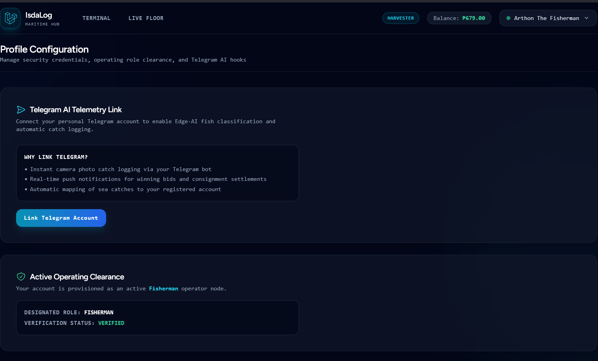
</p>


```php
// app/Http/Controllers/Api/UserController.php
$cacheKey = 'telegram_bind_' . $validated['token'];
$userId = Cache::get($cacheKey);
$user->update(['telegram_chat_id' => $validated['telegram_chat_id']]);

```

(Code Reference: `app/Http/Controllers/Api/UserController.php`)

---

#### Step 2: Multi-Modal AI Fish Identification & Weather Telemetry

* Inside Telegram, the bot clears authentication and waits for a photo payload.


* When a catch photo is uploaded, the service initiates two background checks:


1. **Open-Meteo Weather Safety Check:** Evaluates port wind speeds in Zamboanga del Norte against the 30 km/h gale safety threshold (`checkSeaConditions()`).


2. **Multi-Modal Vision Pipeline:** Dispatches the image matrix to Google Gemini 2.5 Flash (with automatic edge failover to local Ollama `llama3.2-vision`), identifying the biological species (e.g., *Yellowstripe Scad*).

<p align="center">
  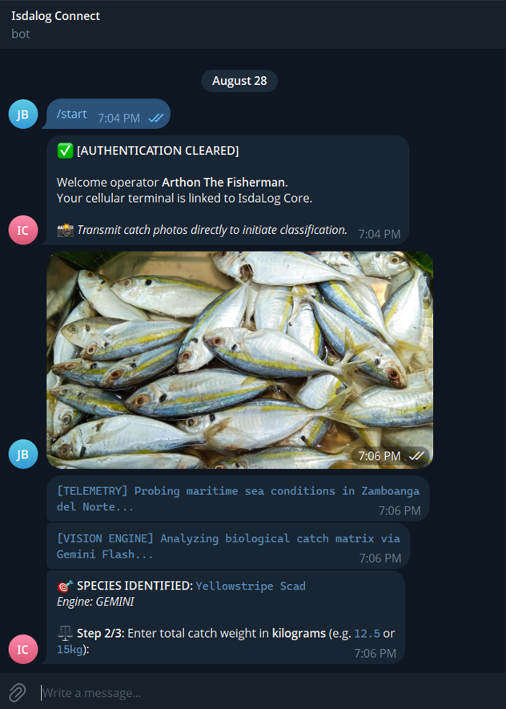
</p>

---

#### Step 3: Valuation, Staging, and Floor Publication

* The bot prompts the harvester for gross weight (`13 kg`) and asking price per kilogram (`₱120.00 / kg`), automatically calculating the consignment floor value (`₱1,560.00`).


* After selecting the landing hub (*Dipolog Port*), the bot renders an interactive summary card.


* Tapping **🚀 Confirm & Publish to Floor** invokes `isdalog.api.js`, transmitting the image base64, weather telemetry, and coordinates to the Laravel API.

<p align="center">
  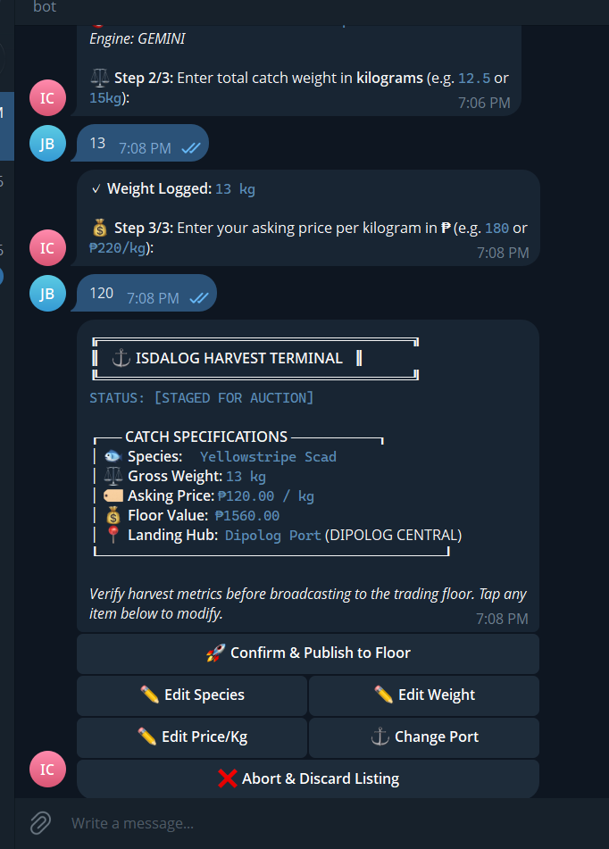
</p>

---

#### Step 4: Sub-Second WebSocket Live Floor Broadcasting

* Laravel persists the biological catch entry in `catches`, uploads the image to the public disk, creates a listing record in `listings`, and dispatches the `CatchBidUpdated` event via Laravel Reverb.


* The harvest batch appears live across all active market sessions instantly.

<p align="center">
  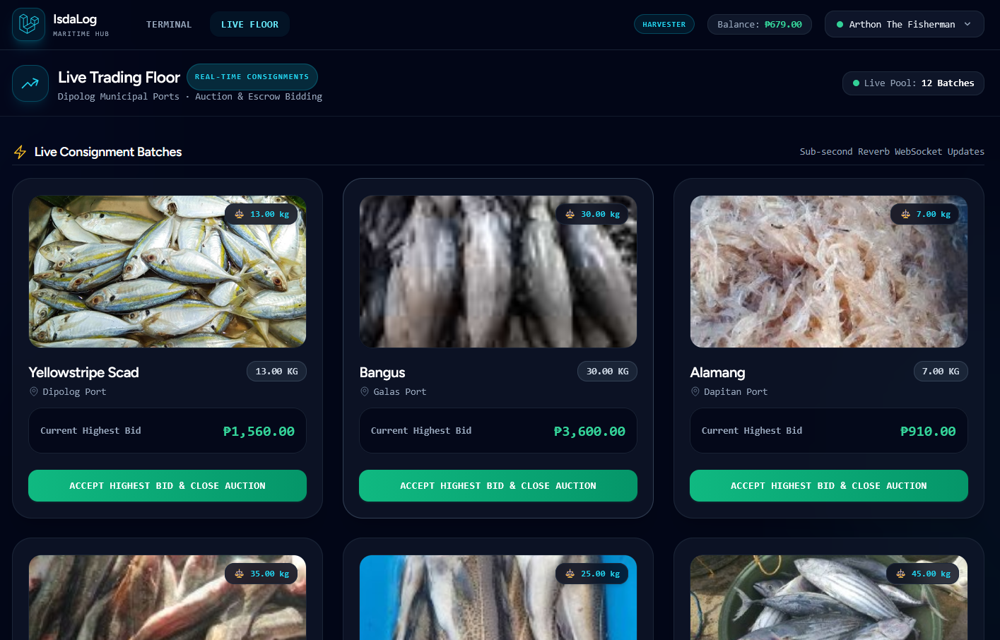
</p>


---

### Phase 2: Consignment Buyer Workflow (Real-Time Bidding & Escrow Locking)

#### Step 5: Trading Desk Liquidity & Consignment Monitor

* The buyer logs into the terminal with the `buyer` role (e.g., **Maria the Merchant**).


* The **Consignment Trading Desk** provides real-time telemetry over active bids, won consignments, available liquid wallet funds (`₱8,800.00`), and funds currently locked in transit escrow (`₱5,500.00`).

<p align="center">
  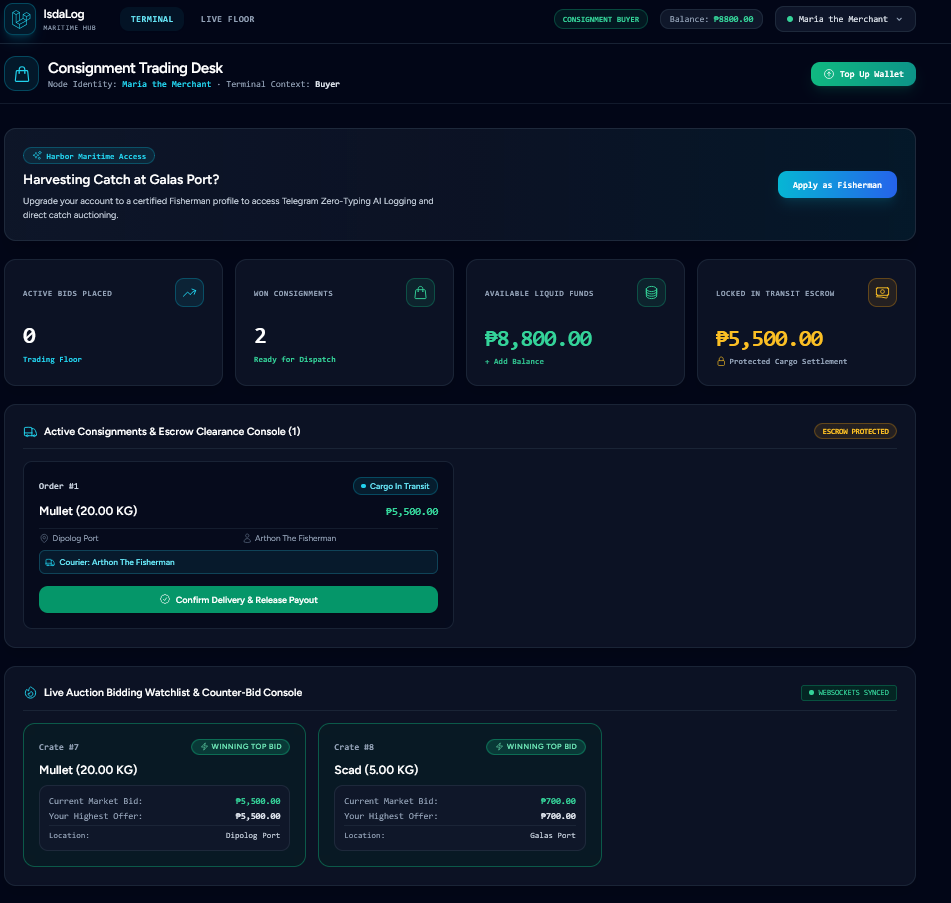
</p>

---

#### Step 6: Live WebSocket Bidding on Harvest Batches

* Navigating to the **Live Floor**, the buyer monitors live-streamed catch batches offloaded at municipal ports.

<p align="center">
  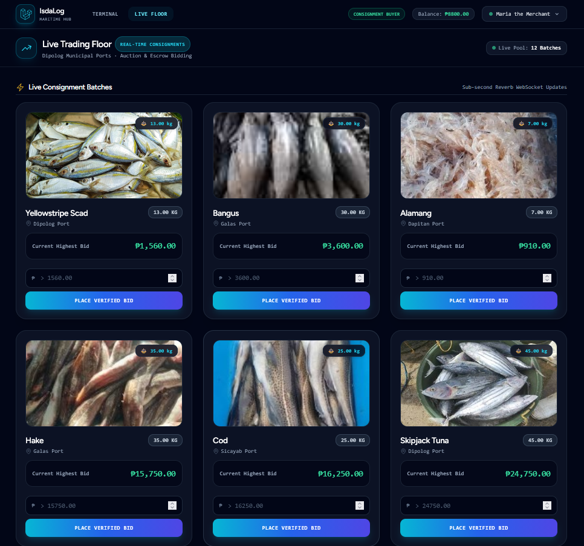
</p>

* Finding the **Yellowstripe Scad** (13.00 kg) previously registered by the fisherman at a floor price of `₱1,560.00`, the buyer enters a higher counter-offer of `₱1,600.00`.


* Clicking **Place Verified Bid** dispatches a sub-second WebSocket event (`CatchBidUpdated`), broadcasting the new `₱1,600.00` leading bid across the entire marketplace pool without page reload.

<p align="center">
  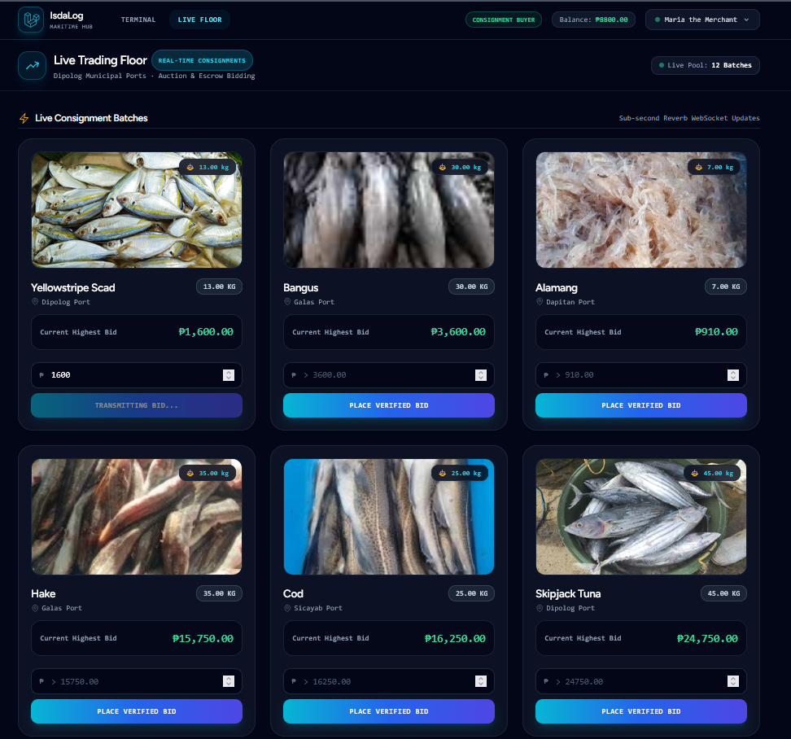
</p>


---

### Phase 3: Cold-Chain Logistics & Dual-OTP Custody Chain

```text
┌─────────────────────────────────────────────────────────────────────────────────────────┐
│                           CRYPTOGRAPHIC CHAIN OF CUSTODY                                │
├──────────────────────────┬─────────────────────────────┬────────────────────────────────┤
│ 1. Port Pickup Handshake │ 2. Live Telemetry Transit   │ 3. Buyer Drop-off Handshake    │
│ Harvester holds:         │ Rider streams live GPS      │ Buyer holds:                   │
│ [ PICKUP OTP: 766973 ]   │ coordinates to Leaflet Map  │ [ DELIVERY OTP: 388403 ]       │
│ Rider inputs to CLAIM    │ Status: EN ROUTE            │ Rider inputs to COMPLETE RUN   │
└──────────────────────────┴─────────────────────────────┴────────────────────────────────┘

```

#### Step 7: Port Claim & Cargo Handshake Hand-off

* When the harvester accepts the winning `₱1,600.00` bid, Laravel executes an atomic transaction: the buyer's liquid wallet balance is debited, `₱1,600.00` is locked into escrow (`orders_logistics.escrow_balance`), and an active delivery run is staged on the dispatch board.


* The logistics rider (**Raider**) arrives at the landing port, inspects the physical crate, and inputs the harvester's **Pickup OTP** (`766973`).


* Submitting the valid OTP moves the consignment state from `pending_dispatch` to `en_route` and locks the rider into **Active Custody Run #3**.

<p align="center">
  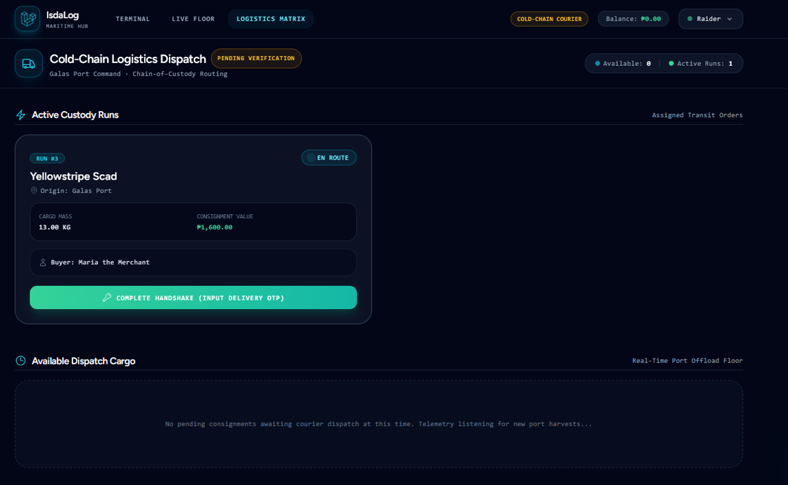
</p>

---

#### Step 8: Live GPS Telemetry Stream & Delivery OTP Provisioning

* While the rider is in transit, the buyer's **Active Consignments Receiving Bay** displays an active Leaflet map streaming live GPS coordinates from the rider's device over private WebSocket channels (`orders.{orderId}`).


* The buyer is issued a private, 6-digit cryptographic clearance token: **`DELIVERY HANDSHAKE OTP: 388403`**.

<p align="center">
  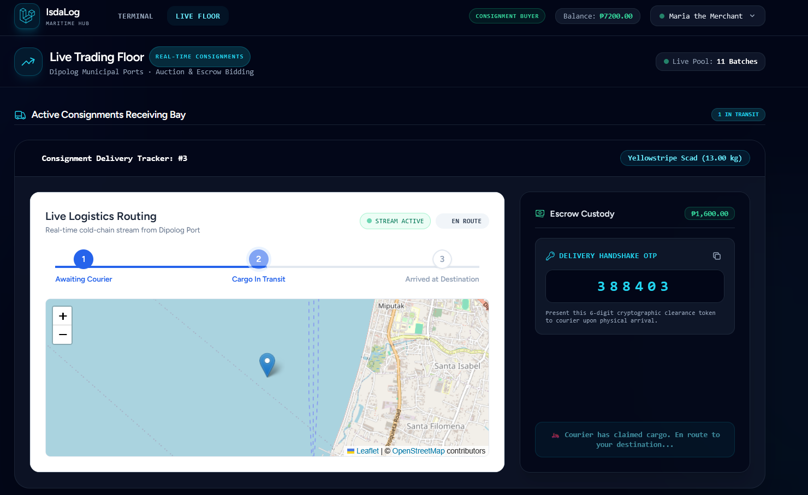
</p>


---

#### Step 9: Final Delivery Verification

* Upon arrival at the delivery destination, the rider requests the clearance code from the buyer and enters `388403` into the terminal.


* The system transitions the cargo status to `delivered` and prompts the rider console with `✓ Cargo Handed Over · Awaiting Escrow Release`.

<p align="center">
  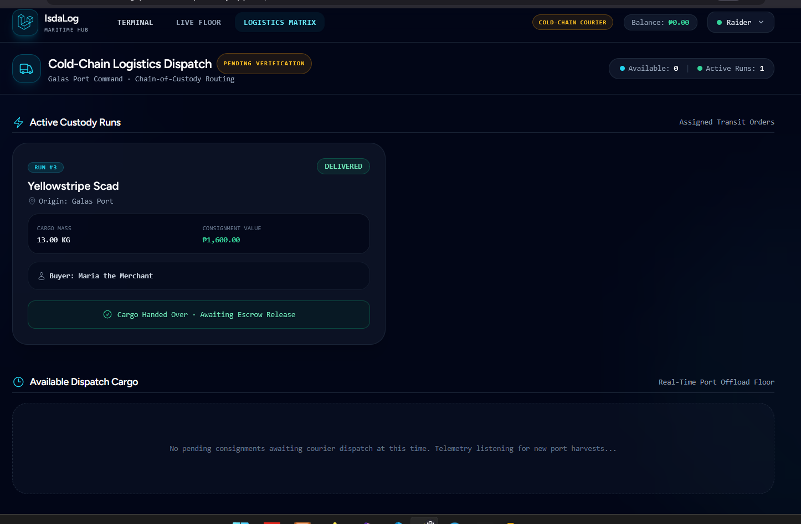
</p>


---

### Phase 4: Atomic Settlement & Dual Evaluation

#### Step 10: Escrow Release & Multi-Party Revenue Split

* With cargo physical delivery authenticated, the buyer's terminal updates the tracking status to **Arrived at Destination / Delivered** and unlocks the **🛡️ Verify Inspection & Release Escrow** button.


* Clicking **Verify Inspection & Release Escrow** opens the dual-evaluation modal to submit 1–5 star reviews for catch freshness (Fisherman) and handling speed (Rider).


* Upon form submission, `OrderConfirmationController` executes the financial distribution within an atomic database transaction (`DB::transaction` with `lockForUpdate`):

```php
// app/Http/Controllers/OrderConfirmationController.php
$catchPrice     = (float) $order->catch_price;
$deliveryFee    = (float) $order->delivery_fee;
$fishermanShare = round($catchPrice * 0.97, 2); // 97% Net Harvester Payout
$platformShare  = round($catchPrice * 0.03, 2); // 3% Platform Governance Fee
$riderShare     = $deliveryFee;                 // 100% Courier Logistics Fee

$this->creditWallet($order->fisherman_id, $order->id, $fishermanShare, 'catch_sale');
$this->creditWallet($platformAdmin->id, $order->id, $platformShare, 'platform_fee');
if ($order->rider_id && $riderShare > 0) {
    $this->creditWallet($order->rider_id, $order->id, $riderShare, 'delivery_fee');
}

```

(Code Reference: `app/Http/Controllers/OrderConfirmationController.php`)

<p align="center">
  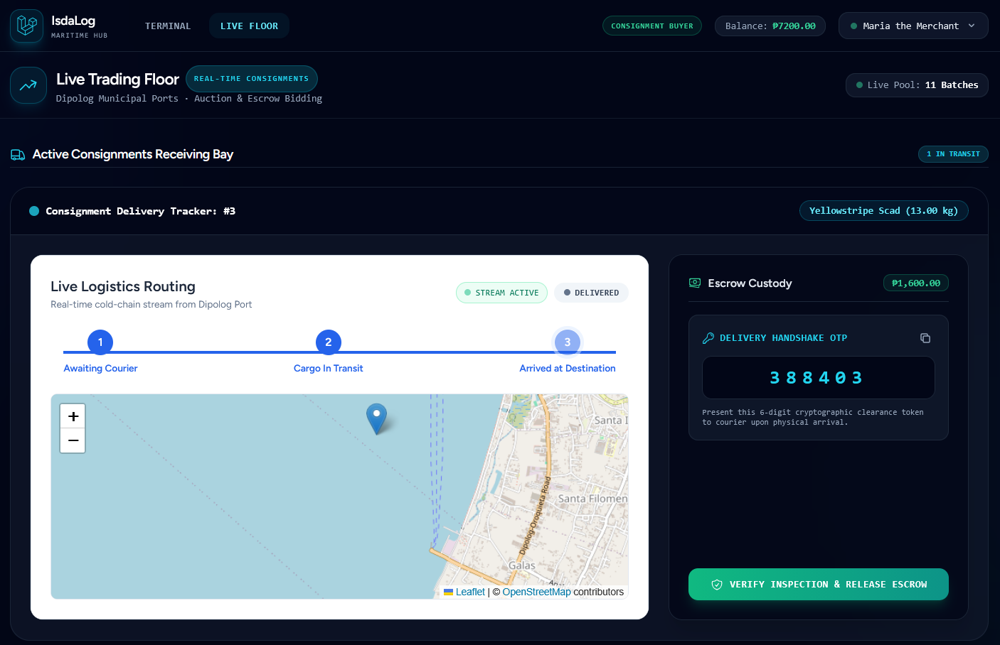
</p>


---


## Project Structure

```text
isdalog-ecosystem/
├── app/                                   # Laravel Core Application Layer
│   ├── Events/                            # WebSocket Broadcast Events
│   │   ├── CargoStatusUpdated.php         # Logistics state change broadcasts
│   │   ├── CatchBidUpdated.php            # Live auction bid updates
│   │   ├── OrderDispatched.php            # Courier dispatch broadcast
│   │   └── RiderLocationUpdated.php       # Live GPS telemetry stream
│   ├── Http/
│   │   ├── Controllers/                   # Marketplace, Dispatch, Wallet & Admin Controllers
│   │   │   └── Api/                       # External Ingestion Endpoints (CatchController, UserController)
│   │   ├── Middleware/                    # Inertia shared state & Sanctum auth gates
│   │   └── Requests/                      # Rate-limited Form Requests (LoginRequest, ProfileRequest)
│   ├── Jobs/                              # Asynchronous Queue Workers (SendSmsNotification)
│   ├── Models/                            # Eloquent Models (User, Listing, Bid, FishCatch, MarketPrice)
│   └── Services/                          # Domain Services (PayoutDisbursement, Sms, WeatherTelemetry)
├── bootstrap/                             # Application bootstrap & middleware configuration
├── config/                                # Subsystem configs (broadcasting, reverb, sanctum, database)
├── database/
│   ├── factories/                         # Model factories for automated feature testing
│   ├── migrations/                        # Relational schemas (users, listings, bids, orders_logistics, escrows)
│   └── seeders/                           # Seeders (AdminSeeder, HistoricalListings, DefenseDaySeeder)
├── resources/
│   ├── js/
│   │   ├── Components/                    # Atomic UI components & DeliveryTracker (Leaflet)
│   │   ├── Layouts/                       # Authenticated and Guest Layout shells
│   │   └── Pages/                         # Inertia Views (Marketplace, Dispatch, BfarDashboard, Profile)
│   └── views/                             # Root Blade application view (app.blade.php)
├── routes/                                # Route definitions (web.php, api.php, channels.php, auth.php)
├── services/                              # Node.js Edge Microservice Services
│   ├── ai.service.js                      # Dual Cloud (Gemini) / Edge (Ollama) inference client
│   ├── isdalog.api.js                     # Secure HTTP payload bridge to Laravel Core
│   └── weather.service.js                 # Open-Meteo port wind speed & safety threshold evaluator
├── tests/
│   └── Feature/                           # Comprehensive PHPUnit Test Suites (Bidding, Escrow, Telemetry)
├── index.js                               # Node.js Telegram Bot Gateway Entry Point
├── Modelfile                              # Ollama LLaMA 3.2 Vision VRAM-optimized model manifest
├── package.json                           # Workspace Node.js dependency manifest
├── composer.json                          # Laravel PHP dependency manifest
└── vite.config.js                         # Vite build pipeline configuration

```

---

## Environment Configuration

| Variable | Description | Required | Default / Example |
| --- | --- | --- | --- |
| `APP_NAME` | Primary application branding name | Yes | `IsdaLog` |
| `APP_ENV` | Application runtime environment | Yes | `local` / `production` |
| `APP_KEY` | 32-character AES-256 application encryption key | Yes | `base64:...` |
| `APP_URL` | Base URL for web and routing generation | Yes | `http://localhost:8000` |
| `DB_CONNECTION` | Primary database driver | Yes | `mysql` (or `sqlite`) |
| `DB_HOST` | Database server hostname | Yes | `127.0.0.1` |
| `DB_PORT` | Database server connection port | Yes | `3306` |
| `DB_DATABASE` | Database name | Yes | `isdalog` |
| `DB_USERNAME` | Database connection username | Yes | `root` |
| `DB_PASSWORD` | Database connection password | No | `""` |
| `BROADCAST_CONNECTION` | Real-time broadcasting driver | Yes | `reverb` |
| `REVERB_APP_ID` | Reverb WebSocket application identifier | Yes | `isdalog-app-id` |
| `REVERB_APP_KEY` | Reverb WebSocket public client key | Yes | `isdalog-reverb-key` |
| `REVERB_APP_SECRET` | Reverb WebSocket secret authentication key | Yes | `isdalog-reverb-secret` |
| `REVERB_HOST` | Reverb WebSocket server binding host | Yes | `localhost` |
| `REVERB_PORT` | Reverb WebSocket server port | Yes | `8080` |
| `TELEGRAM_BOT_TOKEN` | Bot token obtained from Telegram BotFather | Yes | `123456789:ABCDefgh...` |
| `GEMINI_API_KEY` | Google AI Studio Gemini API Key | Optional | `AIzaSy...` |
| `OLLAMA_BASE_URL` | Local edge Ollama API URL endpoint | Yes | `[http://127.0.0.1:11434](http://127.0.0.1:11434)` |
| `ISDALOG_API_URL` | Upstream Laravel API base endpoint for bot bridge | Yes | `[http://127.0.0.1:8000/api](http://127.0.0.1:8000/api)` |

---

## Getting Started & Local Setup

### Prerequisites

* **PHP:** `>= 8.2` with `pdo_mysql`, `mbstring`, `curl`, `openssl` extensions enabled
* **Composer:** `>= 2.x`
* **Node.js:** `>= 18.x` & `npm`
* **Database:** MySQL 8.0+ or SQLite 3
* **Containerization (Optional):** Docker Engine v24+ & Docker Compose
* **Edge AI (Optional):** Ollama installed locally (`ollama pull llama3.2-vision:latest`)

### Installation & Execution

#### 1. Backend Core & Web Terminal (`isdalog`)

Clone the repository and install PHP dependencies:

```bash
git clone https://github.com/JamesIan-Bayonas/isdalog.git
cd isdalog
composer install
npm install

```

Configure your environment file and generate the application encryption key:

```bash
cp .env.example .env
php artisan key:generate

```

Run database migrations and populate seed data (including BFAR administrators and regional species price indexes):

```bash
php artisan migrate:fresh --seed

```

Start the Vite asset compilation server:

```bash
npm run dev

```

In separate terminal panes, start the Reverb WebSocket server, background queue worker, and Laravel HTTP server:

```bash
# Start Real-Time WebSocket Server
php artisan reverb:start

# Start Asynchronous Background Worker (SMS / Notifications)
php artisan queue:work

# Start Application HTTP Server
php artisan serve

```

#### 2. Edge Ingestion & Telegram Bot Gateway (`fisheries-ai`)

Install Node.js service dependencies:

```bash
npm install

```

Initialize your Ollama vision model (if evaluating local edge inference):

```bash
ollama create llama3.2-vision -f Modelfile
ollama run llama3.2-vision

```

Launch the Telegram bot listener:

```bash
node index.js

```

---

## Verification & Testing

The repository includes end-to-end PHPUnit feature tests covering race-condition hardening, wallet escrow math, WebSocket authorization, and asynchronous job queuing.

```bash
# Execute the entire automated test suite
php artisan test

# Run specific domain test suites
php artisan test tests/Feature/CargoHandshakeTest.php
php artisan test tests/Feature/WalletWithdrawalTest.php
php artisan test tests/Feature/AsyncSmsQueueTest.php
php artisan test tests/Feature/SecurityAndComplianceTest.php

```

---

## Security & Operational Readiness

* **Authentication & RBAC:** Multi-guard authentication architecture using Laravel Sanctum for API token validation and stateful session guards across four strict operational roles: `fisherman`, `buyer`, `rider`, and `admin`.
* **Private Channel Authorization:** WebSockets broadcasting on sensitive channels (`private-orders.{orderId}`) enforce authorization gates in `routes/channels.php` to prevent eavesdropping on live buyer bids or courier GPS telemetry.
* **Input Sanitization & Injection Defense:** Regex filtering sanitizes all incoming cellular and Telegram payload data before passing arguments to backend database models.
* **Rate Limiting & Lockout Defense:** Built-in form request rate limiters (`LoginRequest`) protect authentication endpoints against brute-force attacks via IP-and-email keyed throttles.
* **Transactional Financial Integrity:** Payout disbursements and escrow state mutations are wrapped in atomic database transactions (`DB::transaction`) utilizing row-level database locking (`lockForUpdate`) to guarantee double-spend prevention.
